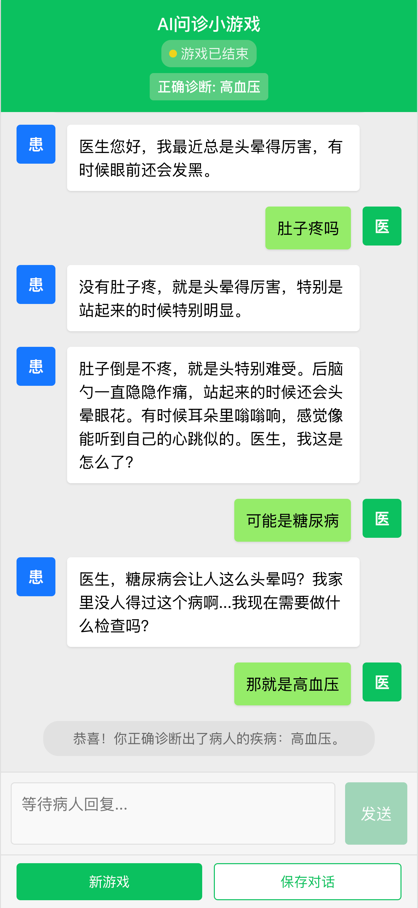

# AI 问诊小游戏

一个受猜盐小程序启发的基于 LLM 的医生问诊游戏，玩家扮演医生通过询问与检查来诊断病人的疾病。但尝试优化了病人的逻辑，病人不再知道自己的病名，而是通过引入 body 和 system 两个 node 来完成对症状的把握和判断回答的正误。

## 游戏截图



## 项目结构

```
├── api.py              # Flask后端API
├── game_engine.py      # 游戏核心逻辑
├── doctor_game.py      # 原命令行版本游戏
├── requirements.txt    # Python依赖
├── dotenv.sample       # 环境变量模板
└── frontend/           # React前端
    ├── package.json      # 前端依赖
    └── src/              # 前端源代码
        ├── App.js          # 主应用组件
        └── components/     # UI组件
```

## 技术栈

- 后端：Python + Flask
- 前端：React + Styled-Components
- AI：基于 ARK API 的大语言模型

## 安装与启动

### 1. 安装后端依赖

```bash
# 创建环境变量文件
cp dotenv.sample .env
# 编辑.env文件，添加你的ARK API密钥

# 安装依赖
pip install -r requirements.txt
```

### 2. 安装前端依赖

```bash
cd frontend
npm install
```

### 3. 启动后端服务

```bash
python api.py
```

### 4. 启动前端服务（开发模式）

```bash
cd frontend
npm start
```

访问 http://localhost:3000 即可开始游戏

### 5. 部署构建版（生产环境）

如果需要部署优化后的生产版本，可以按照以下步骤操作：

```bash
# 进入前端目录
cd frontend

# 创建优化的生产构建
npm run build

# 安装serve工具（如果尚未安装）
npm install -g serve

# 使用serve部署构建后的应用
serve -s build
```

构建后的应用将在 http://localhost:3000（默认端口）上运行。你也可以指定其他端口：

```bash
serve -s build -l 8000
```

这将在 http://localhost:8000 上启动应用。

如果需要在生产环境中部署，可以将`build`文件夹部署到任何静态文件服务器上，如 Nginx、Apache 等。

## 游戏规则

1. 你扮演一名医生，通过询问病人症状诊断疾病
2. 病人会回答你的问题，有时可能会询问自己的身体感受（这会提供更详细的症状）
3. 当你认为已经确定诊断时，直接告诉病人诊断结果（例如："你患有高血压"）
4. 只有准确说出病名才算胜利

## 游戏心得

- 细心询问病人的症状和感受
- 注意症状的组合和关联性
- 系统性思考，逐步排除可能性
- 耐心是好医生的美德！

## 游戏角色

1. **病人**：来到医院问诊室的患者，向医生描述症状。
2. **身体**：了解病人的具体病名，但只会向病人提供症状信息。
3. **系统**：管理游戏进程，判断游戏是否结束，检查各方回复的合理性。
4. **医生**：由玩家扮演，通过与病人交流诊断疾病。

## 游戏流程

1. 游戏从病人问好开始
2. 病人每次收到医生的回复后，可以决定是否与身体交流，然后向医生作出回复
3. 系统会审核每条消息，判断格式和逻辑的正确性
4. 当医生正确诊断出病人的疾病时，游戏结束

## 安装与运行

### 安装依赖

请按照以下步骤安装游戏所需依赖：

```bash
# 创建环境变量文件
cp dotenv.sample .env
# 编辑.env文件，添加你的ARK API密钥

# 安装Python依赖
pip install -r requirements.txt

# 安装前端依赖
cd frontend
npm install
```

### 启动开发环境

使用开发脚本同时启动前后端服务：

```bash
./start_dev.sh
```

这个脚本会自动：

1. 启动 Flask 后端服务
2. 启动 React 前端开发服务器
3. 在您退出时关闭所有进程

或者，您也可以分别启动后端和前端：

```bash
# 启动后端
python api.py

# 启动前端（在另一个终端窗口）
cd frontend
npm start
```

### 环境变量配置

游戏使用.env 文件管理环境变量，需要配置以下变量：

```
# OpenAI API配置
ARK_API_KEY=your_api_key_here
API_BASE_URL=https://ark.cn-beijing.volces.com/api/v3
MODEL_ID=your_model_id
```

请确保替换`ARK_API_KEY`为您的实际 API 密钥。

## 游戏记录

每次对话都会保存在`conversations`目录下，文件名格式为`conversation_YYYYMMDD_HHMMSS.txt`。
